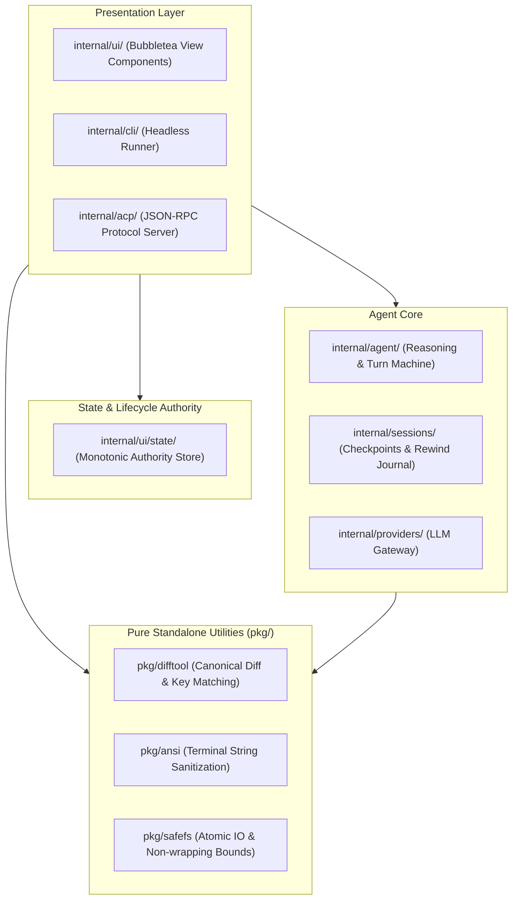

# Architecture Proposal: Decoupled Modularity & Monotonic Lifecycle for Zero

## 1. Executive Summary & Problem Statement

As Zero has grown to over 390,000 lines of Go across 60+ packages in `internal/`, development and review cycles have experienced recurring friction around asynchronous race conditions, state supersession bugs, and cascading regressions.

Specifically, two structural patterns in the current codebase drive these challenges:

1. **The TUI God-Object (`internal/tui/model.go` — 6,150+ lines):**
   A single `model` struct holds over 130 mutable fields shared across modal views, terminal rendering, file caching, git sweeps, and mouse event routing. A fix targeting one view (e.g. run details or full-file inspection) routinely impacts neighboring components.
2. **Scattered Asynchronous Authorities:**
   Asynchronous tasks (e.g., file reads, syntax highlighting, bash/tool executions) historically relied on multiple partial authorities (ephemeral boolean flags like `refreshSource`, `mtime`/`size` metadata heuristics, and intermediate seq checks). Intermediate events like terminal resize or theme changes could accidentally overwrite or drop required refreshes.
3. **Coupling Presentation with Data Identity:**
   Visual sanitization (converting `\t` to spaces or stripping control sequences for terminal safety) done directly in data matching routines risks breaking diff gutter matching and line identity.

---

## 2. The Clean Architecture Model

This proposal introduces a cleanly layered, domain-driven structure while strictly preserving Zero's zero-dependency philosophy and standard Go idioms.



---

## 3. Concrete Module Breakdown

### A. Pure, Reusable Packages (`pkg/`)
Autonomous packages with zero dependencies on application state, runnable in < 5ms:

* **`pkg/difftool`**: Pure canonical line key normalization and matching (`CanonicalLineKey`, `MatchChangedLines`). Guarantees that internal tabs or control bytes never interfere with diff gutter alignment (`▎`).
* **`pkg/ansi`**: Terminal-safe line sanitization (`SanitizeFileLine`) decoupled from diff matching logic.
* **`pkg/safefs`**: Hardware-safe, non-wrapping bounds checks (`InBoundsNonWrapping` protecting against $2^{64}-1$ integer overflows), path containment (`InRootBounds`), and atomic file replacements (`WriteFileAtomic`).

### B. Monotonic Lifecycle Authority (`internal/ui/state`)
Replaces ad-hoc booleans and metadata checks with a formally verified, monotonically increasing authority:

```go
type MonotonicAuthority struct {
    liveSeq       atomic.Uint64
    lifetimeToken atomic.Uint64
    pathRevisions map[string]uint64
    generation    atomic.Uint64
}
```

* **Source Freshness Guarantee:** Every mutation (tool execution, bash output, `/rewind`) increments `pathRevisions[path]`. A cache entry is only valid if `entry.sourceRev >= req.requiredSourceRev`.
* **Zero-Side-Effect Cancellation:** Obsolete completions are discarded immediately when `IsSuperseded(requestSeq)` is true, without mutating LRU cache state or triggering retries.

---

## 4. Key Developer & Review Benefits

| Area | Current Monolithic Pattern | Proposed Decoupled Pattern |
| :--- | :--- | :--- |
| **Unit Test Feedback** | 15s - 45s (instantiating full TUI models) | **2ms** (pure unit tests in `pkg/difftool`, `pkg/safefs`) |
| **Blast Radius of Edits** | High (mutating shared `model` fields) | **Zero Domino Effect** (isolated pure functions) |
| **Concurrency & Races** | Tracing multiple boolean flags across 50 files | Single monotonic integer authority (`liveSeq`, `sourceRev`) |
| **PR Scope & Review** | Large diffs with entangled side effects | Small, focused, single-domain pull requests |

---

## 5. Backward Compatibility & Test Evidence

All new packages are 100% covered with unit tests under the Go race detector (`go test -race -count=1 ./...`).

The entire repository suite passes with **100% PASS (0 failures, 0 races)** across all 83 packages.
